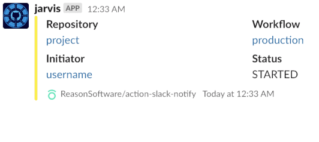

# action-notify-slack

[](https://github.com/ReasonSoftware/action-notify-slack/releases/latest)
[](https://goreportcard.com/report/github.com/ReasonSoftware/action-notify-slack)
[](https://hub.docker.com/r/reasonsoftware/action-notify-slack)
[](LICENSE.md)

A **GitHub Action** for sending notifications as Slack Attachments



## Features

- Easily notify using a default template
- Replace default template with your own
- Add more fields on top of default/custom template
- Update previously sent messages
- Update single notification across multiple jobs in a workflow
- Send multiple Attachments
- Incredibly fast! About 2MB docker image

## Manual

1. Create a [Secret](https://help.github.com/en/actions/configuring-and-managing-workflows/creating-and-storing-encrypted-secrets)  containing a **Slack Token** ([manual](docs/SLACK.md#slack-token)).
2. Create a [Secret](https://help.github.com/en/actions/configuring-and-managing-workflows/creating-and-storing-encrypted-secrets)  containing a **Slack Channel ID** ([manual](docs/SLACK.md#slack-channel)).
3. Add **action-notify-slack** to your workflow:

```yaml
    - name: Notification
      uses: docker://reasonsoftware/action-notify-slack:v1
      env:
        TOKEN: ${{ secrets.SLACK_TOKEN }}
        CHANNEL: ${{ secrets.SLACK_CHANNEL }}
        STATUS: started
```

## Configuration

Configure this action via environmental variables:

- **Required settings**:
  - `TOKEN`: [Slack Token](docs/SLACK.md#slack-token)
  - `CHANNEL`: [Slack Channel](docs/SLACK.md#slack-channel)
- **Optional settings**:
  - `STATUS`: defines a color of an attachment and text under **Status** field. Choose one of the following:
    - `running/started/building/initializing`: Yellow :yellow_square:
    - `deploying/uploading/publishing/creating`: Orange :orange_square:
    - `finished/succeeded/passed/built/released`: Green :green_square:
    - `failed/aborted/canceled/terminated`: Red :red_square:
    - **Anything Else**: Gray :white_large_square:
  - `TIMESTAMP`: update previously sent message by providing an output of a previous step
  - `ATTACHMENTS_FILE`: provide a path to JSON file containing a valid **Slack Attachment** to override a message template with your own (`STATUS` and `SEPARATOR` will be ignored)
  - `SEPARATOR`: argument separator for additional fields (default `==`)
  - `TIMESTAMP_FILE`: a path to a file (directory and file will be created if not exist) which will contain a timestamp. Used as a *buffer* on complex flows that constantly update the same message (*If used in multi-job workflow, you will have to collect that file as an artifact and extract it in another job*)
  - `FAIL`: failure trap which will tweak the message to be **failed** on value `"true"`. Useful in a mid flow notification with parameter: `FAIL: "${{ failure() }}"` (enables to send a `finished` or `failed` message in a single step)

### Examples

<details><summary>:information_source: Additional Fields</summary>

You may add additional fields to a default message template via arguments

- Default separator `==` may be changed by setting an environmental variable `SEPARATOR` with a custom value
- Arguments are expected to be divided by new line `\n`
- Field Name or Values should be enclosed in `"` if they contain whitespace

```yaml
    - name: Notification
      uses: docker://reasonsoftware/action-notify-slack:v1
      env:
        TOKEN: ${{ secrets.SLACK_TOKEN }}
        CHANNEL: ${{ secrets.SLACK_CHANNEL }}
        STATUS: finished
      with:
        args: |
          "Download URL"==<https://my-website.com/file.exe|file>
          Version==v3.1.0
```

</details>

<details><summary>:information_source: Custom Message</summary>

Create a JSON file with Slack attachments and provide a path as an environmental variable. For instance:

- Use another action to create attachments with your information dynamically
- Use a **shell** to create attachments dynamically
- Store it somewhere and fetch the file during the execution with `curl` or `wget`
- Commit a base skeleton to the repository and modify it in a dedicated step

```yaml
    - name: Notify Slack
      uses: docker://reasonsoftware/action-notify-slack:v1
      env:
        TOKEN: ${{ secrets.SLACK_TOKEN }}
        CHANNEL: ${{ secrets.SLACK_CHANNEL }}
        ATTACHMENTS_FILE: attachments.json
```

#### :warning: Remarks

- Provide either a single attachment (`{}`) or a list of attachments (`[]`) in a single JSON file
- Design your message [here](https://api.slack.com/docs/messages/builder?msg=%7B%22attachments%22%3A%5B%7B%22fallback%22%3A%22Required%20plain-text%20summary%20of%20the%20attachment.%22%2C%22color%22%3A%22%2336a64f%22%2C%22pretext%22%3A%22Optional%20text%20that%20appears%20above%20the%20attachment%20block%22%2C%22author_name%22%3A%22Bobby%20Tables%22%2C%22author_link%22%3A%22http%3A%2F%2Fflickr.com%2Fbobby%2F%22%2C%22author_icon%22%3A%22http%3A%2F%2Fflickr.com%2Ficons%2Fbobby.jpg%22%2C%22title%22%3A%22Slack%20API%20Documentation%22%2C%22title_link%22%3A%22https%3A%2F%2Fapi.slack.com%2F%22%2C%22text%22%3A%22Optional%20text%20that%20appears%20within%20the%20attachment%22%2C%22fields%22%3A%5B%7B%22title%22%3A%22Priority%22%2C%22value%22%3A%22High%22%2C%22short%22%3Afalse%7D%5D%2C%22image_url%22%3A%22http%3A%2F%2Fmy-website.com%2Fpath%2Fto%2Fimage.jpg%22%2C%22thumb_url%22%3A%22http%3A%2F%2Fexample.com%2Fpath%2Fto%2Fthumb.png%22%2C%22footer%22%3A%22Slack%20API%22%2C%22footer_icon%22%3A%22https%3A%2F%2Fplatform.slack-edge.com%2Fimg%2Fdefault_application_icon.png%22%2C%22ts%22%3A123456789%7D%5D%7D)
- Remember to provide only the **attachments** and not a whole message

</details>

<details><summary>:information_source: Update Message</summary>

- Add an `id` field to a first notification in a workflow
- Reference `outputs.timestamp` of previously set `id` as a `TIMESTAMP` env.var in the next notification
  - You may chain more notification steps using the same technique. Just keep adding `id`'s :wink:

```yaml
    - name: Notify
      id: notify
      uses: docker://reasonsoftware/action-notify-slack:v1
      env:
        TOKEN: ${{ secrets.SLACK_TOKEN }}
        CHANNEL: ${{ secrets.SLACK_CHANNEL }}
        START: building

    - name: Update Notification
      uses: docker://reasonsoftware/action-notify-slack:v1
      env:
        TOKEN: ${{ secrets.SLACK_TOKEN }}
        CHANNEL: ${{ secrets.SLACK_CHANNEL }}
        STATUS: released
        TIMESTAMP: ${{steps.notify.outputs.timestamp}}
      with:
        args: |
          Download==<https://my-website.com/file.exe|file>
          Version==v3.1.0
```

</details>

<details><summary>Timestamp File Buffer</summary>

- Add an `id` to your first notification in a workflow
- Reference `outputs.timestamp` of previously set `id` as a `TIMESTAMP` env.var in the next notification
  - You may chain more notification steps using the same technique. Just keep adding `id`'s :wink:

```yaml
jobs:
  ci:
    name: build
    runs-on: ubuntu-latest
    steps:
      - name: Notification
        uses: docker://reasonsoftware/action-notify-slack:v1
        env:
          TOKEN: ${{ secrets.SLACK_TOKEN }}
          CHANNEL: ${{ secrets.SLACK_CHANNEL }}
          STATUS: started
          TIMESTAMP_FILE: .github/notify.ts

      - name: Checkout
        uses: actions/checkout@v2
      
      - name: Build
        run: docker build --tag=org/proj:tag .
      
      - name: Notification
        uses: docker://reasonsoftware/action-notify-slack:v1
        env:
          TOKEN: ${{ secrets.SLACK_TOKEN }}
          CHANNEL: ${{ secrets.SLACK_CHANNEL }}
          STATUS: publishing
          TIMESTAMP_FILE: .github/notify.ts
      
      - name: Push
        run: docker push org/proj:tag

      - uses: actions/upload-artifact@v2
        with:
          name: timestamp
          path: .github/notify.ts

      - name: Notification
        if: ${{ failure() }}
        uses: docker://reasonsoftware/action-notify-slack:v1
        env:
          TOKEN: ${{ secrets.SLACK_TOKEN }}
          CHANNEL: ${{ secrets.SLACK_CHANNEL }}
          STATUS: failed
          TIMESTAMP_FILE: .github/notify.ts

  cd:
    name: deploy
    runs-on: ubuntu-latest
    steps:
      - uses: actions/download-artifact@v2
        with:
          name: timestamp
          path: .github/notify.ts

      - name: Notification
        uses: docker://reasonsoftware/action-notify-slack:v1
        env:
          TOKEN: ${{ secrets.SLACK_TOKEN }}
          CHANNEL: ${{ secrets.SLACK_CHANNEL }}
          STATUS: deploying
          TIMESTAMP_FILE: .github/notify.ts
      
      - name: Deploy
        run: helm upgrade --install application repository/application
      
      - name: Notification
        uses: docker://reasonsoftware/action-notify-slack:v1
        env:
          TOKEN: ${{ secrets.SLACK_TOKEN }}
          CHANNEL: ${{ secrets.SLACK_CHANNEL }}
          STATUS: finished
          FAIL: ${{ failure() }}
          TIMESTAMP_FILE: .github/notify.ts
```

</details>

## Notes

- This action is automatically built at [**Docker Hub**](https://hub.docker.com/r/reasonsoftware/action-notify-slack), and tagged with `latest / v1 / v1.2 / v1.2.3` allowing to lock against a certain version
*It's recommended to lock against a major version, for example* `v1`
- Docker image is published both to [**Docker Hub**](https://hub.docker.com/r/reasonsoftware/action-notify-slack) and [**GitHub Packages**](https://github.com/ReasonSoftware/action-notify-slack/packages). If you don't want to rely on **Docker Hub** but still want to use the dockerized action, you may switch from `uses: docker://reasonsoftware/action-notify-slack:v1` to `uses: docker://docker.pkg.github.com/reasonsoftware/action-notify-slack/action-notify-slack:v1`

## License

[Apache-2.0](LICENSE.md) © 2021 [Reason Cybersecurity Ltd.](https://www.reasonsecurity.com/)
