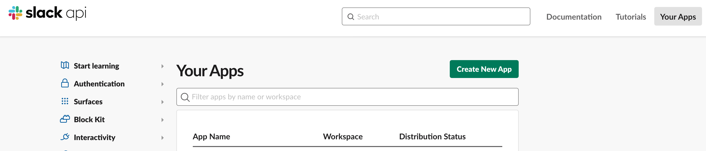
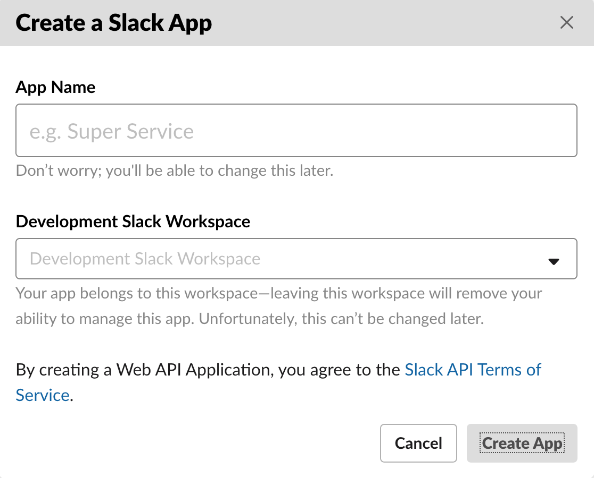
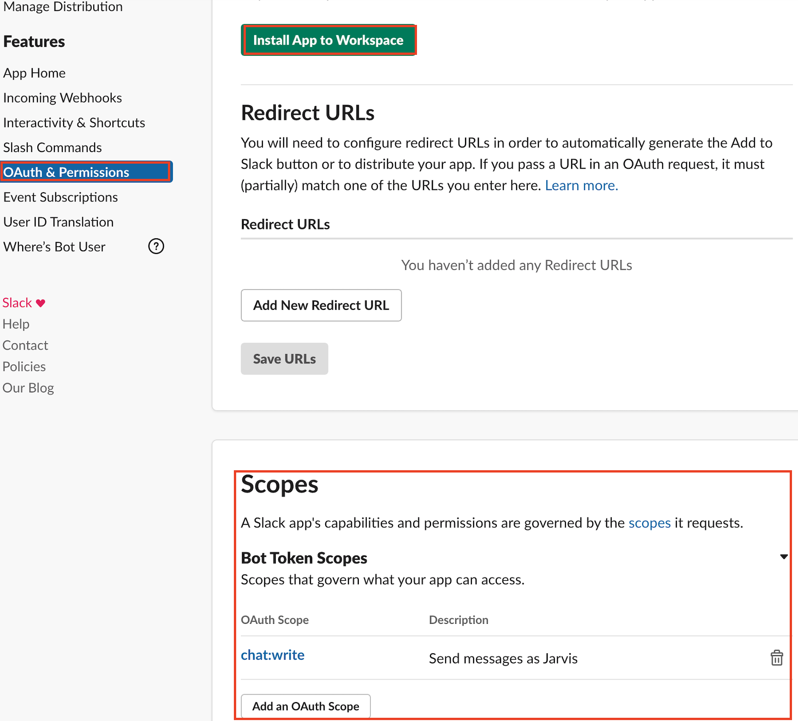
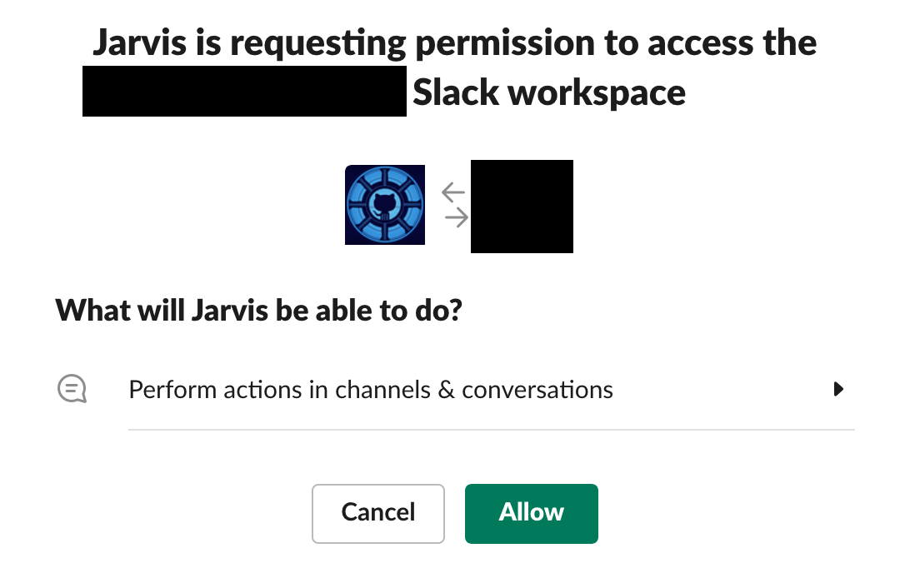
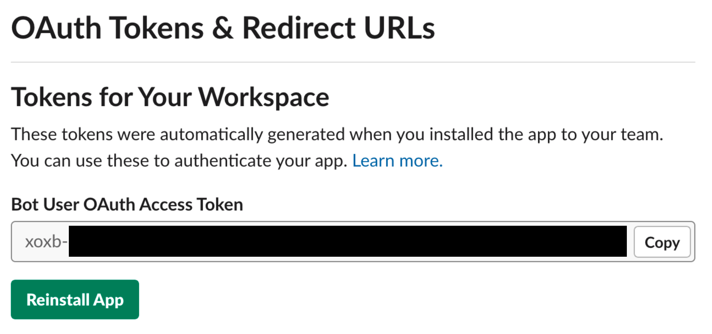

# Slack Token

1. Go to Slack [Apps](https://api.slack.com/apps) and create new Application

2. Give your application a Name and select target Workspace

3. Add `chat:write` **Bot Scope** under **OAuth & Permissions** and click `Install App to Workspace`

4. Validate and Allow installation

5. You may find a **Token** under **OAuth & Permissions**

# Slack Channel

1. Login to Slack web client and select a desired Channel

2. You may get a **Channel ID** from a URL `https://app.slack.com/client/<workspace>/<channel-id>`
